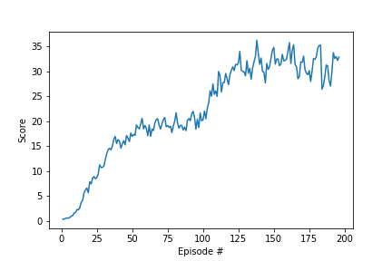

# Learning Algorithm

I implemented a DDPG algorithm to train the agent. The model achitechture consists of actor and critic networks each 
containing 3 hidden layers with 512 leaky-ReLU units each.

Here are the hyper parameters used for training.

* BUFFER_SIZE = int(1e5)  (replay buffer size)
* BATCH_SIZE = 128        (minibatch size)
* GAMMA = 0.99            (discount factor)
* TAU = 1e-3              (for soft update of target parameters)
* LR_ACTOR = 1e-5         (learning rate of the actor)
* LR_CRITIC = 1e-4        (learning rate of the critic)
* WEIGHT_DECAY = 0        (L2 weight decay)

I used the Unity environment containing 20 different agents. At each step of the environment `(state, action, reward, next_state, done)` tuples are computed for each of the 20 agents and added to the replay buffer. The code then runs 2 optimization steps with each with a different sample from the replay buffer.

# Q-Function Model Description
The Q function model is a feedforward neural network with 37 input units with two hidden layers of 64 units and relu activations and a final linear output layer of 4 outputs.

# Plot of Rewards (each point is a mean over all 20 agents)

# Ideas for Future Work
Interestingly, larger networks and small learning rates seemed to be advantageous for the DDPG agent. It would be worth it to try even larger networks then the ones used here. Other types of actor-critic RL algorithms such as A3C would also be worth trying.